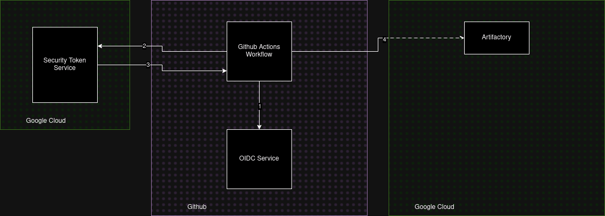

# Cloud IAM Permissions Assignment

## Overview
In this assignment, you will work with Google Cloud Platform (GCP) and GitHub Actions to create an Artifact Registry, configure Cloud IAM permissions using Workload Identity Federation, and set up a CI/CD pipeline to build and push a Docker image to the registry.



The `Workload Identity Pool` has direct IAM permissions on a Google Cloud Artifactory repository. You will be responsible for creating both the Artifactory and the binding permissions on behalf of the Workload Identity. This method of access GCP resources from Github is preferred since it directly authenticates GitHub Actions to Google Cloud without a proxy resource. 

You will be graded on the following:
1. **Working Github Action Workflow**: Create a CI workflow that will build and push an image to gcr.io Container Repository
2. **Configure Direct Workload Identity Federation**: Create Workload Identity Pool that has IAM permissions to GCP Artifactory
3. **Create an Artifact Repository**: Create GCP Artifact Repository for our image
4. **IAM Permissions**: Configuring Workload Identity Federation for GitHub Actions authentication and authorize access to GCP Artifactory.

## Rubric

| **Criteria**                               | **Description**                                                                              | **Points** |
|--------------------------------------------|----------------------------------------------------------------------------------------------|------------|
| **Working GitHub Action Workflow**         | The GitHub Action should build a Docker image and push it to Artifact Registry without errors. | 2 pt       |
| **OIDC Workload Federation Identity**      | Correctly configure OIDC Workload Identity Federation to authenticate GitHub Actions to GCP. | 5 pt       |
| **Create Artifact Registry**               | Create an Artifact Registry repository for Docker images in the correct GCP region.          | 3 pt       |
| **Grant Permissions to OIDC PrincipalSet** | Properly grant permissions on your artifactory to the Workload Identity Federation and OIDC. | 5 pt       |

## Prerequisites
- GCP account
- **Public** Github account so that we have access to Github Action Workflow runners

## Resources
- [Direct Workload Identity Federation](https://github.com/google-github-actions/auth?tab=readme-ov-file#preferred-direct-workload-identity-federation)
- [Create Docker Artifactory](https://cloud.google.com/artifact-registry/docs/repositories/create-repos#create-repo-gcloud-docker)
  - **Please omit the --kms-key and --immutable-tags --async** flags
  - ` gcloud artifacts repositories create YOUR_REPOSITORY_NAME --repository-format=docker --location=[REGION] --description="some description" --project=[PROJECT ID]`
- [Artifactory Access Control](https://cloud.google.com/artifact-registry/docs/access-control)
- [Github Action](https://docs.github.com/en/actions/writing-workflows/quickstart)

## Submission
You will submit your Github project link to Canvas, and include the following in your repository:

- logging.json - exported logs of GCP activity (Logging Service in GCP)
- metrics.csv - exported metrics data from Workload Identity Pools (IAM > Workload Identity Federation > ellipsis on graph > "View In Metrics Explorer" > Download)

You must have all your files merged to `main`. 

## Helpful commands

### List Artifactory
```shell
 gcloud artifacts repositories list --project=[PROJECT ID] --location=[REGION]
```

### Verify permissions on artifactory
```shell
gcloud artifacts repositories get-iam-policy dansc0de \
  --location=us-central1 \
  --project="${PROJECT_ID}"
```

